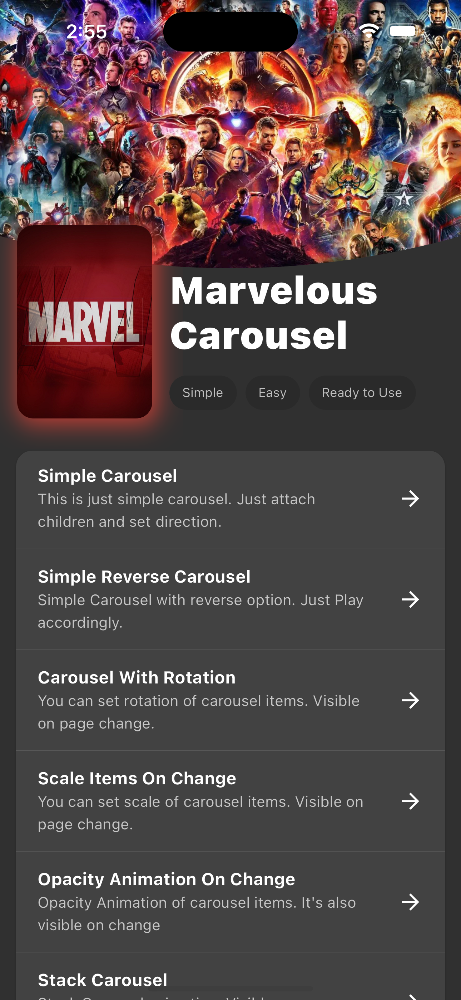

# This is Marvelous Carousel

Marvelous Carousel is a widget that allows you to horizontally or vertically scroll through multiple images or items. It is commonly used in applications where users need to browse a collection of images or rotate through content. For example, you can use Carousel for a product gallery, a news feed, or an event calendar.


[][linkedin]
[][github]


## 📸 Screenshots
 
|Main Screen|Simple|Rotation|
|----|----|----|
||||

|Scale Items|Opacity Animation|Stack|
|----|----|----|
||||

### Simple Carousel Example

You can easily incorporate a simple carousel into your app with the following code:

```dart
StackSlider
(
scrollDirection: Axis.horizontal, // Scroll direction for the pager
children: <Widget>[ // Add your child widgets here
Container(
color: Colors.deepPurple,
child: Center(
child: Card(
shape: CircleBorder(),
child: Image.asset("images/watch_1.jpg"),
),
),
),
// Add more items here...
]
,
)
```

Result:


### Rotational Carousel Example

To create a rotational carousel, add the `rotationY` attribute to the `StackSlider`:

```dart
StackSlider
(
rotationY: 60, // Unselected item rotation value
scrollDirection: Axis.horizontal, // Scroll direction for the pager
children: <Widget>[ // Add your child widgets here
Container(
color: Colors.deepPurple,
child: Center(
child: Card(
shape: CircleBorder(),
child: Image.asset("images/watch_1.jpg"),
),
)
,
)
,
// Add more items here...
]
,
)
```

Result:


### Scaled Item Carousel Example

You can create a scaled item carousel by adjusting the `scaleX` and `scaleY` attributes:

```dart
StackSlider
(
scaleX: 0.8, // Minimum scaleX value 
scaleY: 0.4, // Minimum scaleY value 
scrollDirection: Axis.horizontal, // Scroll direction for the pager
children: <Widget>[ // Add your child widgets here
Container(
color: Colors.deepPurple,
child: Center(
child: Card(
shape: CircleBorder(),
child: Image.asset("images/watch_1.jpg"),
),
),
),
// Add more items here...
],
)
```

Result:


### Opacity Carousel Example

To create an opacity carousel, set the minimum opacity value using the `opacity` attribute:

```dart
StackSlider
(
opacity: 0.4, // Minimum opacity value for the items
scrollDirection: Axis.horizontal, // Scroll direction for the pager
children: <Widget>[ // Add your child widgets here
Container(
color: Colors.deepPurple,
child: Center(
child: Card(
shape: CircleBorder(),
child: Image.asset("images/watch_1.jpg"),
),
)
,
)
,
// Add more items here...
]
,
)
```

Result:


### Stack Slider Example

To create a stack slider, change the `PagerType` to `PagerType.stack`:

```dart
StackSlider
(
pagerType: PagerType.stack, // Change the StackSlider behavior to stack slider
scrollDirection: Axis.vertical, // Scroll direction for the pager
children: <Widget>[ // Add your child widgets here
Container(
color: Colors.deepPurple,
child: Center(
child: Card(
shape: CircleBorder(),
child: Image.asset("images/watch_1.jpg"),
)
,
)
,
)
,
// Add more items here...
]
,
)
```

Result:


### Overscroll Stack Slider Example

To create an overscroll stack slider, add the `overscroll` attribute and set the `pagerType`
to `PagerType.stack`:

```dart
StackSlider
(
overscroll: -300, // Over Scroll value when the user slides in or slides off
pagerType: PagerType.stack, // Set the pager type to stack
scrollDirection: Axis.horizontal, // Scroll direction for the pager
children: <Widget>[ // Add your child widgets here
Container(
color: Colors.deepPurple,
child: Center(
child: Card(
shape: CircleBorder(),
child: Image.asset("images/watch_1.jpg"),
),
),
),
// Add more items here...
]
,
)
```

Result:


## Finite StackSlider Attribute List

Here are the details of all attributes:

| Attribute Name   | Description                                                           | Applicable Type |
|:-----------------|:----------------------------------------------------------------------|:----------------|
| pagerType        | Set the StackSlider type, i.e., PagerType.Carousel & PagerType.Stack  | -               |
| reverse          | Reverse the order if set to true                                      | Both            |
| scrollDirection  | Scroll direction of your pager, i.e., Axis.Horizontal & Axis.Vertical | Both            |
| viewPortFraction | Set the view port fraction                                            | Carousel        |
| pageSnapping     | Snap to the selected or current page                                  | Both            |
| physics          | Define ScrollPhysics, affecting scrolling velocity, etc.              | Both            |
| onPageChanged    | Callback that returns the current index whenever an item is selected  | Both            |
| scaleX           | Minimum x-scale of unselected page                                    | Both            |
| scaleY           | Minimum y-scale of unselected page                                    | Both            |
| opacity          | Set opacity of unselected page                                        | Both            |
| rotationX        | Maximum x-rotation of unselected page                                 | Carousel        |
| rotationY        | Maximum y-rotation of unselected page                                 | Carousel        |
| overscroll       | Apply overscroll effect to the last item                              | Stack           |
| key              | Set a key for the pager                                               | Both            |
| children         | List of child widgets to add to the pager                             | -               |
| dotsVisible      | set true if you want to see dots                                      | -               |

## MIT License

Copyright (c) 2023 Selman Poyraz


[linkedin]: https://www.linkedin.com/in/kaz%C4%B1m-selman-poyraz-0048b7143/
[github]: https://github.com/kspo

[pull_down_button]: https://pub.dev/packages/pull_down_button#pulldownbuttontheme
[marqueer]: https://pub.dev/packages/marqueer
[chart_sparkline]: https://pub.dev/packages/chart_sparkline